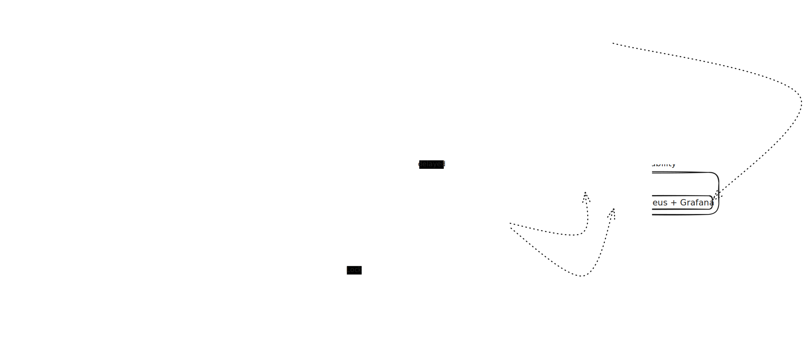

# High-Throughput Distributed Notification Service

[](https://openjdk.java.net/)
[](https://spring.io/projects/spring-boot)
[](https://kafka.apache.org/)
[](https://www.postgresql.org/)
[](https://redis.io/)

A horizontally scalable notification service for **Email**, **SMS**, and **Push** delivery with idempotent processing, provider failover, and full observability.

**Key features:**
- Two-barrier idempotency (Redis SETNX + distributed locks)
- Kafka-based async processing with retry and dead-letter queues
- Provider failover with Resilience4j circuit breakers
- Prometheus/Grafana metrics and Loki log aggregation

---

## Architecture



---

## Tech Stack

| Layer | Technology |
|-------|-----------|
| Framework | Java 21, Spring Boot 4.0.4 |
| Database | PostgreSQL 16 |
| Cache/Locks | Redis 7.x |
| Messaging | Apache Kafka (Confluent 7.5) |
| Resilience | Resilience4j (circuit breakers + retry) |
| Observability | Micrometer, Prometheus, Grafana, Loki |
| Schema Mgmt | Flyway |

---

## Design

### Provider dispatch (Strategy pattern)
```
ProviderStrategyFactory
├── EMAIL: SendGrid (primary) -> AWS SES (fallback)
├── SMS:   Twilio (primary)   -> AWS SNS (fallback)
└── PUSH:  FCM (primary)      -> APNs (fallback)
```

### Idempotency
1. **API layer**: Redis `SETNX` on the `Idempotency-Key` header (24h TTL)
2. **Consumer layer**: Distributed lock per notification ID to prevent concurrent processing

---

## Project Structure

```
src/main/java/com/notificationservice/
├── config/           # Filters, metrics
├── controller/       # REST endpoints
├── dto/              # Request/Response objects
├── entity/           # JPA entities
├── enums/            # ChannelType, NotificationStatus, Priority
├── exception/        # Custom exceptions + global handler
├── idempotency/      # Redis dedup + distributed locks
├── kafka/
│   ├── producer/     # Kafka event publishing
│   └── consumer/     # Notification processing
├── provider/         # Strategy pattern providers
│   ├── email/
│   ├── sms/
│   └── push/
├── repository/       # Spring Data JPA
└── service/          # Core business logic
```

---

## Quick Start

### Prerequisites
- Java 21+
- Docker & Docker Compose

### Run
```bash
# Start infra (Kafka, PostgreSQL, Redis, Prometheus, Grafana)
docker-compose up -d

# Run the app
./mvnw spring-boot:run
```

### Example request
```bash
curl -X POST http://localhost:8080/api/v1/notifications \
  -H "Content-Type: application/json" \
  -H "Idempotency-Key: unique-key-123" \
  -d '{
    "channel": "EMAIL",
    "recipient": "user@example.com",
    "subject": "Welcome!",
    "body": "Thanks for signing up."
  }'
```

---

## Performance Targets

| Metric | Target |
|--------|--------|
| Throughput | 5,000+ req/sec |
| p95 Latency | < 500ms |
| Duplicate Rate | 0% |

---

## Load Testing

Uses a standalone Java 21 virtual threads load tester (no external tools needed):

```bash
# Default: 5000 requests, 500 virtual threads
java loadtest/LoadTest.java

# Custom
java loadtest/LoadTest.java 10000 1000
```

---

## Observability

### Monitoring Stack
- **Prometheus**: http://localhost:9090 — metrics collection
- **Grafana**: http://localhost:3000 (admin/admin) — pre-built dashboard with API/consumer/provider metrics
- **Loki**: http://localhost:3100 — log aggregation

### Management Tools
- **pgAdmin**: http://localhost:5050 (admin@example.com/admin) — query/inspect PostgreSQL tables
- **Redis Commander**: http://localhost:8081 — view idempotency keys and locks in real-time

### Health & Metrics Endpoints
- Health check: http://localhost:8080/actuator/health
- Raw Prometheus metrics: http://localhost:8080/actuator/prometheus

> **Tip**: After running the load test, check Grafana's circuit breaker panels to see provider failover in action.

---

## Author

**Ankit Kumar Shaw**
